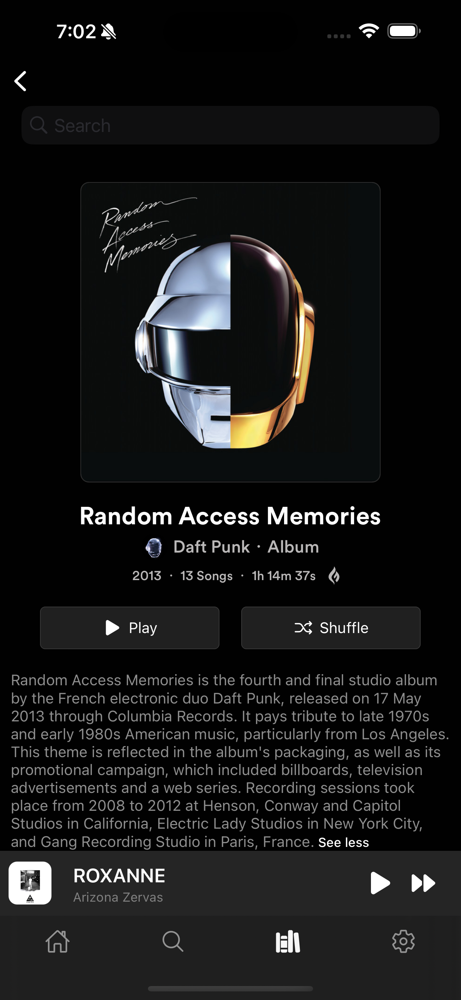

    

    

  

  
  
  
  

  
  

# Vibe

**Vibe** is an open-source music app UI designed to provide a sleek, modern, and user-friendly experience. Perfect for music enthusiasts and developers, Vibe combines intuitive design with powerful features.

## Features 🚀

- **Clean and Modern Interface**: Enjoy a visually appealing dark-themed design that's easy on the eyes.
- **Customizable Themes**: Personalize your app with different themes or create your own.
- **API Integration**: Seamlessly connect to popular music streaming APIs for easy access to your favorite tunes.
- **Responsive Design**: Optimized for both mobile and desktop devices, ensuring a consistent experience.
- **Smooth Animations**: Enjoy fluid and interactive animations that enhance usability.

## Screenshots

|                                                                                                           |                                                                                                |                                                                                                       |
| :-------------------------------------------------------------------------------------------------------: | :--------------------------------------------------------------------------------------------: | :---------------------------------------------------------------------------------------------------: |
|                     |  |  |
|  |         |       |

> [!CAUTION]  
> The UI is not compatible with expo go app. You have to prebuild your expo app.

## Installation 🛠

To install Vibe, follow these steps:

1. Clone the repository: `git clone https://github.com/rit3zh/Vibe`
2. Navigate to the project directory: `cd vibe`
3. Install dependencies: `npm install`
4. Navigate to the ios directory: `cd ios` and install all the required pods `pod install`
5. Finally run the application: `npm run ios`

### ⭐ Consider leaving a Star if you like this repository. ⭐
